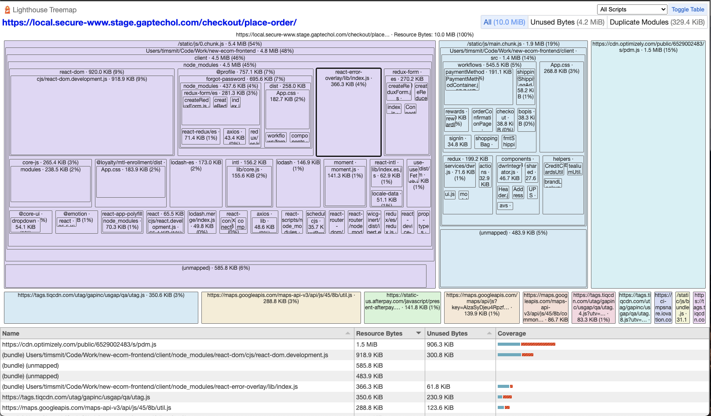

# Lighthouse-Puppeteer
## This is a tool we can use to test websites with Lighthouse and Puppeteer. We can build on this tool for monitoring *Performance* and *Accessibility*!




### Setup

```bash
nvm install v16.4.2
npm i
```
or
```bash
nvm use v16.4.2
npm i
```

On either `Staging` or `prelive`, add an item to you cart and go to checkout as usual.  Then, instead of going to `local.` in your browser, go to it in this app.

You can change the `URL` in `index.js` on line 9, and in `index2.js` on line 12.

### Cookies


**IT WILL NOT WORK** without cookies.

You can export the cookies from the browser and use them in this app.

1. Export the cookies from the browser.
2. Run the exported code through https://jsonformatter.curiousconcept.com/# to JSONify it.
3. Paste JSON cookie data into `cookies.json over writing anything from a previous run.

### Reports
Reports are dumped in the root as 

- `Checkout_UI_Lighthouse_Report_[date].json` which could be feed into Splunk and New Relic.
- `Checkout_UI_Lighthouse_Report_[date].html`
